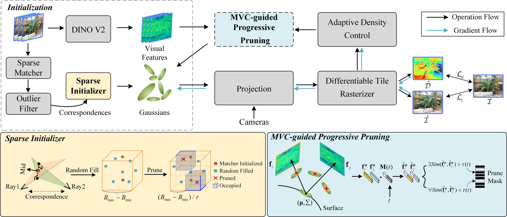

## [MCGS: Multiview Consistency Enhancement for Sparse-View 3D Gaussian Radiance Fields](https://arxiv.org/abs/2410.11394)

## Overview


## Installation
Install the following dependency
```
conda env create -f environment.yml  

pip install ./submodules/diff-gaussian-rasterization  
pip install ./submodules/simple-knn  
pip install ./LightGlue
```

## Dataset
Download Blender Dataset from [Blender](https://github.com/bmild/nerf)  
Download LLFF Dataset from [LLFF](https://github.com/Fyusion/LLFF)
## Usage
### LLFF Dataset
```
bash ./scripts/llff.sh
```
### Blender Dataset
```
bash ./scripts/blender.sh
```

### Citation
```
@article{xiao2024mcgs,
  title={MCGS: Multiview Consistency Enhancement for Sparse-View 3D Gaussian Radiance Fields},
  author={Xiao, Yuru and Zhai, Deming and Zhao, Wenbo and Jiang, Kui and Jiang, Junjun and Liu, Xianming},
  journal={arXiv preprint arXiv:2410.11394},
  year={2024}
}
```

